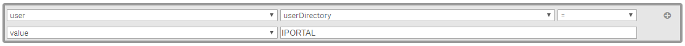

# Governed Self Service Settings Configuration Guide

This is a step-by-step setup guide for the QMC settings in your Governed Self-Service Reference Deployment.   It is recommended you start from a new deployment in a test or local environment in order to fully replicate this deployment.  There are other installation components required to install and configure the complete GSS Reference Deployment. See the Qlik Community called Governed Self-Service for more details.   

<a id="toc"></a>
# Table of Contents

* [Create Tags](#createTags)
    * [How to: Create Tags](#howToCreateTags)
* [Create Custom properties](#createCustomProps)
    * [Custom Propertes for GSS](#gssCustomProps)
    * [How to: Create Custom Properties](#howToCreateCustomProps)
* [Create Streams](#streams)
    * [GSS Streams](#gssStreams)
    * [How to: Create Streams](#howToCreateStreams)
* [Import Apps](#importApps)
    * [Post Import App Configuration](#postImportAppConfig)
* [Security Rules](#secRules)
    * [Disable Default Security Rules](#disableSecurityRules)
        * [How to: Disable Default Security Rules](#howToDisableSecurityRules)
    * [Create Custom Security Rules](#createSecurityRules)
        * [How to: Create Custom Security Rules](#howToSecurityRules)
        * [The Governed Self-Service Reference Deployment Rules](#gssRules)
* [Create User Access Rule](#createUserAccessRule)
* [Set the TeamAdmin custom property on Jeremy and Paul ](#teamAdminUsers)
    * [Jeremy Thomas](#teamAdminJeremy)
    * [Paul Harris](#teamAdminPaul)
* [Set AppLevelMgmt custom property on Laura Johnson](#appLevelLaura)

A definition of each object/resource is provide along with a step-by-step configuration guide.  Where appropriate, a detail explanation of the configuration and it’s purpose within the governed self service deployment is provided.

<a id="createTags"></a>
## Create Tags

Tags are simply labels attached to objects within the QMC for the purpose of identification or to provide other information about an object.  The QMC user interface allows you to sort and/or filter objects and resources using these tags.  We will be using them to easily located resources that we add, modify or disable as part of this configuration.  

Create the following tags using the instructions provided below:

1. Name: **Disabled Default Rule**
2. Name: **Custom Rule**
3. Name: **iPortal User**
4. Name: **PowerTool**

<a id="howToCreateTags"></a>
### How to: Create Tags

1. In the left navigation pane on the QMC Home/Start page, click on **Tags** in the **Manage Resources** section to open the tags management page.

    
2. Click on the **Create new** button located near the bottom of the page.
3. Enter the *Name* of your new tag.  NOTE: We will associate these tags to resources later; for now, there will be no associated items for your new tags.
4. Click the **Apply** button located near the bottom of the page to save your changes.
5. Click the **Add another** button and return to **step #3** until you have created all of the tags listed above.

[Back to Top](#toc)

<a id="createCustomProps"></a>
## Create Custom Properties

Custom Properties are metadata that can be associated to resource types within the QMC.  Each custom property contains a list of possible values.  For example, you could create a custom property named *ReleaseStage* that contains the values *Development*, *Testing* and *Production* and associate it with the Apps resource.  Custom properties are primarily used to configure security rules using metadata rather than explicit values.  For example, you could configure a security rule that restricts access to Apps with a *ReleaseStage* of *Development* to Users with a *QlikFunction* of *Developer*. 

<a id="gssCustomProps"></a>
### GSS Custom Properties
Create the following custom properties:

1. Name: **AppLevelMgmt**
    * *Description*: This custom property allows for app-level exceptions to stream access.  With this custom property an app resides in a stream that many users have access, but only a few have access to the specific application.  
    * *Resource Types*: Apps, Users
    * *Values*: Executive, HR, PCI
2. Name: **DataConnectionType**
    * *Description*: This custom property identifies the type of Data Connection.  This allows you to evaluate the data connection types in security rules.  This comes in handy when developers and designers are allowed to access specific data connections. 
    * *Resource Types*: Data connections
    * *Values*: Admin, Folder, MS Access, ODBC, Oracle, PowerToolQVD, QVD, SQL Server
3. Name: **ManagedMasterItems**
    * *Description*: This custom property is used with the Goverened Metrics Service.  It allows an app to "subscribe" to a subject area of metrics that exist in a central Metrics data source.  A Metrics Library app pushes the appropriate metrics to the master library of apps with the assigned property values.  It is possible to assign more than one subject area to an app.
    * *Resource Types*: Apps
    * *Values*: Customer Service, Finance, Marketing, Sales
4. Name: **QlikGroup**
    * *Description*: This custom property is for Streams, Apps and Data Connections to help manage access rights to users based on their security group membership.  This custom property prevents granular management at the individual object/user level.
    * *Resource Types*: Apps, Data connections, Reload tasks, Streams
    * *Values*: Finance, IT, Marketing, QlikAdmin, Sales
5. Name: **TeamAdmin**
    * *Description*: Certain users in the iPortal deployment are team admins or department admins.  This custom property is assigned to users who will act as content and resource administrators for their departments.
    * *Resource Types*: Users
    * *Values*: Finance, IT, Marketing, Sales

<a id="howToCreateCustomProps"></a>
### How to: Create Custom Properties

1.	In the left navigation pane on the QMC Home/Start page, click on **Custom properties** in the **Manage Resources** section to open the custom properties management page.

    
2.	Click on the **Create new** button located near the bottom of the page.
3.	Enter the *Name* of your new custom property.
4.	Enable each *Resource Type* that is to be associated with the new custom property by clicking on the checkbox.
5.	Click the **Create new** button in the *Values* section and type in a value.  Repeat this step until all of the values have been created.
6.	Click the **Apply** button located near the bottom of the page.
7.	Click the **Add another** button and return to **step #3** until you have created all of the custom properties listed above.

[Back to Top](#toc)

<a id="streams"></a>
## Create Streams

Streams allow you to group applications together for administrative purposes.  This eliminates the need to apply certain settings and authorization rules to each App individually.

A stream enables users to read and/or publish Apps, Sheets, and Stories. Users who have publish access to a stream, create the content for that specific stream. The stream access pattern in a Qlik Sense site is determined by the security rules for each stream. By default, Qlik Sense includes two streams: Everyone and Monitoring apps. An app can be published to only one stream. To publish an app to another stream, the app must first be duplicated and then published to the other stream.

<a id="gssStreams"></a>
### GSS Streams
Create the following streams:

1. **Sales**
2. **Marketing**
3. **Finance**

<a id="howToCreateStreams"></a>
### How to: Create Streams

1.	In the left navigation pane on the QMC Home/Start page, click on **Streams** in the **Manage Content** section to open the streams management page. 

    
2.	Click on the **Create new** button located near the bottom of the page.
3.	Enter the *Name* of your new stream.
4.	Click the **Apply** button located near the bottom of the page to save your changes.  When the Create security rule window is displayed, click the **Cancel** button to continue without creating any rules.  You will create security rules in the next section.
5.	Click the **Add another** button and return to **step #3** until you have created all of the streams listed above.

After creating the streams, edit each stream and add the @QlikGroup custom property value that matches the stream name.


_Example custom property setting on a stream_

[Back to Top](#toc)

<a id="importApps"></a>
## Import Apps

To test Governed Self-Service, the EA Team provides a set of Qlik demo apps to import and set the custom properties detailed above and publish to streams.  With these apps, it is possible to see the impact of setting custom properties along with security rules to control access.  You can download the apps from the **[Governed Self Service space on Community](https://community.qlik.com/docs/DOC-16872)**.

<a id="postImportAppConfig"></a>
## Post Import App Configuration in QMC

Follow the table to publish apps to the appropriate stream.  Set the AppLevelMgmt custom property on the Executive Dashboard app with the value **Executive**.  If installing the Governed Metrics Service along with iportal, add the **Sales** custom property value to the ManagedMasterItems custom property of the Executive Dashboard.

| App Name | Stream | @AppLevelMgmt | @ManagedMasterItems | 
| -------- | :------: | :-------------: | :-------------------: |
| Executive Dashboard | Sales | Executive | Sales |
| Customer Experience [Telco] | Marketing |  |  | 
| Sales Management and Customers Analysis | |  |  | 
| Travel Expense Management | Finance |  |  | 


_Example custom property setting on Executive Dashboard app_

[Back to Top](#toc)

<a id="secRules"></a>
## Security Rules

<a id="disableSecurityRules"></a>
### Disable Default Security Rules

The Qlik Sense system includes an attribute-based security rules engine that uses rules as expressions to evaluate what type of access a user or users should be granted for a resource.

In this section you will disable some default security rules that are provided with the standard Qlik Sense installation - they will be replaced with new custom security rules.  You could just edit the default security rules, but we recommend you follow the best practice guideline of disabling default rules and creating new rules. This allows you to retain the default rules just in case you would like to reference or revert to them in the future.

Disable the following security rules using the step-by-step instructions provided below:
* **ContentAdmin**
* **ContentAdminQmcSections**
* **CreateApp**
* **CreateAppObjectsPublishedApp**
* **DataConnection**
* **Stream**

<a id="howToDisableSecurityRules"></a>
#### How to: Disable Default Security Rules

1.	In the left navigation pane on the QMC Home/Start page, click on **Security rules** in the **Manage Resources** section to open the security rules management page.

     
2.	For each of the security rules list above, locate the rule in the list of rules and double-click on the row.  Alternatively, you can single click on the row and click on the **Edit** button located near the bottom of the page.  
3.	In the *Identification* section of the *security rule form*, click on the **Disabled** checkbox.  
4.	Click on the **Tags** field and select *Disabled Default Rule* from the dropdown.
5.	Click the **Apply** button located near the bottom of the page to save your changes.  
6.	Click on the **Security rules** breadcrumb near the top of the page.
7.	Repeat **steps #2 through #6** for each of the security rules list above.

[Back to Top](#toc)

<a id="createSecurityRules"></a>
### Create Custom Security Rules

<a id="howToSecurityRules"></a>
#### How to: Create Custom Security Rules

1.	In the left navigation pane on the QMC Home/Start page, click on **Security rules** in the **Manage Resources** section to open the security rules management page.

     
2.	Click on the **Create new** button located near the bottom of the page.
3.	Enter the *Name* of your new security rule in the Identification section of the form.
4.	Enter the *Description* in the **Identification** section of the form.
5.	Check or uncheck the appropriate *Actions* in the **Basic** section of the form.
6.	Enter the *Resource filter* in the **Advanced** section of the form.
7.	Enter the *Conditions* in the **Advanced** section of the form.
8.	Select the appropriate *Context* in the **Advanced** section of the form.
9.	Add the appropriate *Tag(s)* in the **Tags** section of the form.
10.	Click the **Apply** button located near the bottom of the page to save your changes.  
11.	Click the **Add another** button and return to step #3 until you have created all of the security rules listed below.

<a id="gssRules"></a>
#### The Governed Self-Service Reference Deployment Rules

The Qlik Sense system includes an attribute-based security rules engine that uses rules to evaluate what type of access a user or users should be granted for a resource.

In this section you will create new security rules to replace and augment those rules disabled in the previous section.  Each new security rule includes a brief description of the rule and its effect on the implementation.

> The security rules defined below use a prefix **_gss** in the security rule’s names.   This prefix is recommended to be your company name or abbreviation.   You can leave this as is or replace it with your own prefix, it will not impact the functioning of the rules.

Create the following security rules using the step-by-step instructions provided below:

> NOTE: You need to enter of the *Resource filter* exactly as it appears below.  Do not use the *Resource filter* dropdown menu within the QMC application form editor. 

1. Name: **_gss a– TeamAdmin QMC Sections**
    * Description: Allow users the QlikTeamAdmins group to have the same rights as users in the Qlik Role "QlikTeamAdmin".
    * Actions: Read
    * Resource filter: QmcSection_App, QmcSection_DataConnection, QmcSection_ContentLibrary,QmcSection_App.Object, QmcSection_Task, QmcSection_ReloadTask, QmcSection_Event, QmcSection_SchemaEvent, QmcSection_CompositeEvent, QmcSection_User
    * Conditions:
    ``` 
	        ((!user.@TeamAdmin.empty()))
    ```
    * Context: Only in QMC
    * Tags: Custom Rule
	
2. Name: **_gss b– TeamAdmin Rights**
    * Description: Grants rights to resources for Team Admins.   It has to be separate from the QMCSections rule for Team Admins, as they operate on different resources.
    * Actions: Create, Read, Update, Delete, Export, Publish, Change role
    * Resource filter: Stream\*, App\*, ReloadTask\*, SchemaEvent\*, Tag\*, CompositeEvent\*, ExecutionResult\*, CustomProperty\*,User_\*, Task\*
    * Conditions:
    ```             	
            ((user.group=user.@TeamAdmin 
            and (user.group=resource.@QlikGroup 
            or user.group = resource.group)
            ))
    ```
    * Context: Only in QMC
    * Tags: Custom Rule

3. Name: **_gss c– Group Access Rule**
    * Description: Allow user access to read for all resources matching the user’s security group value.
    * Actions: Read
    * Resource filter: App\*, Stream_\*
    * Conditions:
    ``` 
            user.group=resource.@QlikGroup
    ```
    * Context: Both in hub and QMC
    * Tags: Custom Rule

4. Name: **_gss d– Stream Rule – Apps Default Rule**
	* Description: Allow users to see/read resources if they have read access to the stream it is published to.
    * Actions: Read
    * Resource filter: App\*
    * Conditions:
    ``` 
            (
                resource.resourcetype = "App" 
                and resource.stream.HasPrivilege("read") 
                and resource.@AppLevelMgmt.empty() 
            ) 
            or
            ( 
                (
                    resource.resourcetype = "App.Object" 
                    and resource.published = "true" 
                    and resource.objectType != "app_appscript" 
                ) 
                and resource.app.stream.HasPrivilege("read") 
            )
    ```
    * Context: Both in hub and QMC
    * Tags: Custom Rule


5. a.   Name: **_gss e1– CreateAppObjectsPublishedApp**
    * Description: Allows users to create app objects of all types on a published app, except for Consumers, who cannot create sheets.
    * Actions: Create
    * Resource filter: App.Object_\*
    * Conditions:
    ``` 
            !resource.App.stream.Empty() 
            and resource.App.HasPrivilege("read") 
            and (
                resource.objectType = "userstate" 
                or (
                    resource.objectType = "sheet"
                    or resource.objectType = "story" 
                    or resource.objectType = "bookmark" 
                    or resource.objectType = "hiddenbookmark" 
                    or resource.objectType = "snapshot"
                    or resource.objectType = "embeddedsnapshot"
                    and user.group != "QlikConsumer"
                )
            )
            and !user.IsAnonymous()
    ```
    * Context: Only in hub
    * Tags: Custom Rule

    b.  Name: **_gss e2– CreateAppObjectsPublishedApp**
    * Description: Allows users to create app objects of all types on a published app, except for Consumers, who cannot create sheets.
    * Actions: Create
    * Resource filter: App.Object_\*
    * Conditions:
    ``` 
            !resource.App.stream.Empty() 
            and resource.App.HasPrivilege("read") 
            and (
                resource.objectType = "userstate" 
                or (
                    resource.objectType = "sheet"
                    or resource.objectType = "story"  
                    or resource.objectType = "snapshot"
                    or resource.objectType = "embeddedsnapshot"
                    and user.group != "QlikConsumer"
                )
            )
            or resource.objectType = "bookmark" 
            or resource.objectType = "hiddenbookmark"
            and !user.IsAnonymous()
    ```
    * Context: Only in hub
    * Tags: Custom Rule

6. Name: **_gss f– Publishing Rights by Role**
	* Description: Allow Contributors, Designers and Developers to publish to streams.  
	* Actions: Read, Publish
	* Resource filter: Stream_\*
	* Conditions:
    ```             
            (   
            user.group = "QlikRootAdmin" 
            or user.group="QlikContributor" 
            or user.group like "*Developer" 
            or user.group="QlikDesigner"
            or user.roles = "Developer"
            )            
            and
            (   
                user.group=resource.@QlikGroup 
            )
    ```
	* Context: Both in hub and QMC
	* Tags: Custom Rule

7. Name: **_gss g– Stream Rule – Apps Exception Rule**
    * Description: Allow users to see apps with exception properties if they also have the same exception properties at the user level.
    * Actions: Read
    * Resource filter: App\*
    * Conditions:
    ``` 
            resource.stream.HasPrivilege("read") 
            and             
            user.@AppLevelMgmt=resource.@AppLevelMgmt
    ```
    * Context: Both in hub and QMC
    * Tags: Custom Rule
	

8. Name: **_gss h– Create App**
    * Description: Allows Developers and Designers to create and publish apps/sheets
    * Actions: Create, Read, Update, Delete, Export, Publish
    * Resource filter: App_\*
    * Conditions:   
    ```      
            (
            user.group="QlikRootAdmin" 
            or user.roles="RootAdmin" 
            or user.group like "*Developer" 
            or user.group="QlikDesigner"
            or user.roles ="Developer"
            )             
            and resource.owner = user
    ```
    * Context: Only in hub
    * Tags: Custom Rule

9. Name: **_gss i– DataConnection Read QVDs**
    * Description: Allow user to read QVD type data connection if they are a Designer.
    * Actions: Read
    * Resource filter: DataConnection_\*
    * Conditions:
    ```             
                (
                    user.group="QlikDesigner"
                    or user.group like "*Developer"
                    or user.roles="Developer" 
                    and resource.@DataConnectionType="QVD"
                ) 
                or 
                (
                    user.group=user.@TeamAdmin
                    or user.group="QlikRootAdmin" 
                )
    ```
    * Context: Only in hub
    * Tags: Custom Rule

10. Name: **_gss j– UpdateAppObjectsPublishedApp**
    * Description: Allows Qlik Developers and Team Admins to change update app objects that are published.  Used for approving and unapproving content.
    * Actions: Update
    * Resource filter: App.Object_\*
    * Conditions:
    ```             
                !resource.App.stream.Empty() 
                and resource.App.HasPrivilege("read") 
                and resource.objectType = "userstate" 
                or (
                    user.group like "*Developer"
                    or user.group=user.@TeamAdmin
                )
                and !user.IsAnonymous()
    ```
    * Context: Both in the hub and the QMC
    * Tags: Custom Rule

11. Name: **_gss k– DataConnection Create**
    * Description: Allow users to create data connections except of type folder.
    * Actions: Create
    * Resource filter: DataConnection_\*
    * Conditions:
    ``` 
            ((user.group="ConnectionCreators" 
            or user.group=user.@TeamAdmin 
            or user.group="QlikRootAdmin"))
    ```
    * Context: Both in hub and QMC
    * Tags: Custom Rule
    
12. Name: **_gss l– Root Admin Group Rule**
	* Description: Allow all access to any user that is a member of the group QlikRootAdmin.
	* Actions: Create, Read, Update, Delete, Export, Publish, Change owner, Change role
	* Resource filter: \*
	* Conditions:
    ```             
            user.group="QlikRootAdmin" 
            or user.roles="RootAdmin"
    ```
	* Context: Only in QMC
	* Tags: Custom Rule
	
13. Name: **_gss M- TeamAdmin Duplicate Rights**
	* Description: Allows Team Admins to duplicate apps in the QMC.
	* Actions: Create, Read, Update, Delete
	* Resource filter: App\*, App_\*
	* Conditions:
    ```             
            (user.group="QlikDeveloper")
		and(user.group=resource.@QlikGroup or 
		resource.owner=user)
    ```
	* Context: Only in QMC
	* Tags: Custom Rule


[Back to Top](#toc)

<a id="createUserAccessRule"></a>
## Create User Access Rule

User and Login Access Rules define which users will automatically be allocated a license token when logging into Qlik Sense.  A *user access rule* allocates a license token to a **named user** whereas a *login access rule* allocates a **login access pass** that allows a user to access Qlik Sense for a predefined amount of time.  Please refer to Qlik Sense online help for more details on login access passes.

The access rules created in this section will leverage a user’s userdirectory value to allocate a token automatically to the user when they log in for the first time.

1.	In the left navigation pane on the QMC Home/Start page, click on **License and tokens** in the **Manage Resources** section to open the license management page. 
2.	Click on the **User access rules** tab on the right side of the page.
3.	Click on the **Create new** button located near the bottom of the page.
4.	Click on the **Basic** and **Tags** properties tab on the right side of the page.  A small checkmark will be displayed on the tab and the **Basic** and **Tags** section of the form will now be visible.
5.	Enter **_gss – User Access Token Rule** as the *Name* of the user access rule.
6.	In the **Basic** section of the form, configure the rule such that **user userdDirectory** is equal to the **value** of **IPORTAL**.

    
7.  Add the *Custom Rule* tag in the **Tags** section of the form. 
8.	Click the **Apply** button located near the bottom of the page to save your changes.  
9.	Click on the **License usage summary** breadcrumb near the top of the page. 

[Back to Top](#toc)

<a id="teamAdminUsers"></a>
## Set the TeamAdmin custom property on Jeremy Thomas and Paul Harris

Earlier in the configuration, a custom property named *TeamAdmin* was created.  It is time to set values of this custom property on iportal users.

1. In the left navigation pane on the QMC Home/Start page, click on **Users** in the **Manage Content** section to open the user management page.
2. Click on the **filter icon** associated with the *User directory* column and type "iportal" in the popup textbox to filter the list of users to only include those from the iPortal UDC.

<a id="teamAdminJeremy"></a>
### For Jeremy Thomas

1. Select Jeremy Thomas and click the **Edit** button at the bottom of the page.
2. Click on the custom properties item on the right hand side of the page.
3. In the dialog box for **TeamAdmin**, select the value **Finance** when the list of values appears.
4. Click the Apply button.

<a id="teamAdminPaul"></a>
### For Paul Harris

1. Select Paul Harris and click the **Edit** button at the bottom of the page.
2. Click on the custom properties item on the right hand side of the page.
3. In the dialog box for **TeamAdmin**, select the values **Sales**  and **Marketing** when the list of values appears.
4. Click the Apply button.

<a id="appLevelLaura"></a>
## Set AppLevelMgmt custom property on Laura Johnson

1. Select Laura Johnson and click the **Edit** button at the bottom of the page.
2. Click on the custom properties item on the right hand side of the page.
3. In the dialog box for **AppLevelMgmt**, select the values **Executive** when the list of values appears.
4. Click the Apply button.


Congratulations!  You have completed the configuration of Governed Self-Service settings in the Qlik Sense Management Console! 

[Back to Top](#toc)
